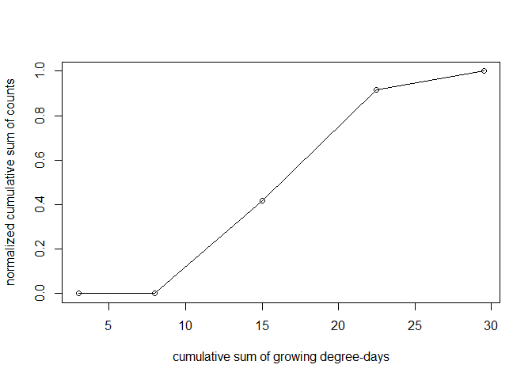

<!-- README.md is generated from README.Rmd. Please edit that file -->

# R pacakge zeppr (Beta!)

<!-- badges: start -->
<!-- badges: end -->

The `zeppr` package for R provides a collection of functions to process
plant protection data. It is actually made for a particular institute
but it may be useful for more persons. It is a beta version provided AS
IS without any guaranty or support. It is available for non-commercial
use at your own risks. Commercial users may contact the package
developer.

## Installation

This package is available from [GitHub](https://github.com/) and was
developed using R 4.2.2. The library `devtools` is required for
installation.

You can install a specific release of `zeppr` as follows to get a stable
set of features:

``` r
# uncomment to install devtools if necessary:
# install.packages("devtools")

# Install release v0.2.1-beta (change release tag as required):
devtools::install_github("JFK24/zeppr@v0.2.1-beta") 
```

Alternatively, you can install the development version of `zeppr` as
follows to get potential new features but also new potential new bugs:

``` r
devtools::install_github("JFK24/zeppr")
```

## Simple use cases

### Use case 1

Let us create some toy count and weather data:

``` r
data.table <- data.frame(
  Date=as.Date(c("2022-03-01", "2022-03-02", "2022-03-03", "2022-03-04", "2022-03-05")),
  Count=c(0, 0, 10, 12, 2),
  Tmin=c(4, 6, 11, 9, 10),
  Tmax=c(12, 14, 13, 16, 14)
  )
head(data.table)
#>         Date Count Tmin Tmax
#> 1 2022-03-01     0    4   12
#> 2 2022-03-02     0    6   14
#> 3 2022-03-03    10   11   13
#> 4 2022-03-04    12    9   16
#> 5 2022-03-05     2   10   14
```

Thanks to `zeppr`, we create easily the normalized cumulative sum of the
counts and the cumulative sum of growing degree-days (5°C\|30°C) as
follows:

``` r
library(zeppr)
data.table$norm_cumsum <- normalized_cumsum(data.table$Count)
data.table <- mutate_cumsum_gdd(
  data.table, date=Date, t.min=Tmin, t.max=Tmax, 
  t.ceiling=30, t.base=5, use.floor=FALSE, hourly.data=FALSE)
head(data.table)
#>         Date Count Tmin Tmax norm_cumsum cumsum_gdd
#> 1 2022-03-01     0    4   12   0.0000000        3.0
#> 2 2022-03-02     0    6   14   0.0000000        8.0
#> 3 2022-03-03    10   11   13   0.4166667       15.0
#> 4 2022-03-04    12    9   16   0.9166667       22.5
#> 5 2022-03-05     2   10   14   1.0000000       29.5
```

Finally we can plot the new values with some plotting functions (not
from `zeppr`):

``` r
plot(data.table$cumsum_gdd, 
     data.table$norm_cumsum, 
     type="o", 
     xlab="cumulative sum of growing degree-days", 
     ylab="normalized cumulative sum of counts")
```



### Use case 2

Let us create some toy locations and corresponding geographic
coordinates:

``` r
library(zeppr)
locations <- data.frame(
  loc=c("A", "B", "C"),
  lat=c(49, 50, 52.52),
  lon=c(8, 9, 13.41)
)
```

Thanks to `zeppr`, we retrieve information on weather stations from DWD
weather service offering data on air temperature as follows:

``` r
stations.info <- get_dwd_stations_info("air_temperature", timerange="recent")
```

``` r
head(stations.info)
#> # A tibble: 6 × 8
#>   station_id start_date end_date   altitude latitude longitude station…¹ bunde…²
#>   <chr>      <date>     <date>        <dbl>    <dbl>     <dbl> <chr>     <chr>  
#> 1 00003      1950-04-01 2011-03-31      202     50.8      6.09 Aachen    Nordrh…
#> 2 00044      2007-04-01 2023-02-08       44     52.9      8.24 Großenkn… Nieder…
#> 3 00052      1976-01-01 1988-01-01       46     53.7     10.2  Ahrensbu… Schles…
#> 4 00071      2009-12-01 2019-12-31      759     48.2      8.98 Albstadt… Baden-…
#> 5 00073      2007-04-01 2023-02-08      340     48.6     13.1  Aldersba… Bayern 
#> 6 00078      2004-11-01 2023-02-08       64     52.5      7.91 Alfhausen Nieder…
#> # … with abbreviated variable names ¹​station_name, ²​bundesland
```

We can search the id and distance in km of the closest station for given
coordinates:

``` r
closer_dwd_station(51.89, 10.54, stations_table=stations.info, return_string="id")
#> [1] "02039"
closer_dwd_station(51.89, 10.54, stations_table=stations.info, return_string="dist")
#> [1] 2.34
```

We can also process the table of locations as follows:

``` r
# With base R
locations$station.id <- closer_dwd_station(locations$lat, locations$lon, 
  stations_table=stations.info, return_string = "id")
locations$station.name <- closer_dwd_station(locations$lat, locations$lon, 
  stations_table=stations.info, return_string = "name")
head(locations)
#>   loc   lat   lon station.id          station.name
#> 1   A 49.00  8.00      00377       Bergzabern, Bad
#> 2   B 50.00  9.00      02480             Kahl/Main
#> 3   C 52.52 13.41      00399 Berlin-Alexanderplatz
```

``` r
# With dplyr and pipes from magrittr (%>%):
locations %>% 
  mutate(station.id=closer_dwd_station(
    lat, lon, stations_table=stations.info)) %>% 
  mutate(station.name=closer_dwd_station(
    lat, lon, stations_table=stations.info, return_string = "name")) %>% 
  mutate(station.distance=closer_dwd_station(
    lat, lon, stations_table=stations.info, return_string = "dist"))
#>   loc   lat   lon station.id          station.name station.distance
#> 1   A 49.00  8.00      00377       Bergzabern, Bad            11.90
#> 2   B 50.00  9.00      02480             Kahl/Main             7.17
#> 3   C 52.52 13.41      00399 Berlin-Alexanderplatz             0.29
```

Finally, we can get the weather data from a given station as follows:

``` r
station.data <- get_dwd_station_data(station_id="00044", category="air_temperature")
```

``` r
head(station.data)
#>   station_id           timestamp Lufttemperatur relative_Feuchte
#> 1      00044 2021-08-08 00:00:00           14.1             93.0
#> 2      00044 2021-08-08 01:00:00           14.4             91.0
#> 3      00044 2021-08-08 02:00:00           14.6             92.0
#> 4      00044 2021-08-08 03:00:00           14.9             91.0
#> 5      00044 2021-08-08 04:00:00           14.7             96.0
#> 6      00044 2021-08-08 05:00:00           15.0             96.0
```

## Access documentation of the main functions from R

``` r
# Already in the latest release
?normalized_cumsum                   # normalized cumulative sum
?growing_degree_days                 # growing degree days for 1 day
?mutate_cumsum_gdd                   # cumulative sum of growing degree-days
?read_isip_hourly_weather_data       # reads weather data from an ISIP Excel file
?mutate_isip_weather_with_cumsum_gdd # cumulative sum of growing degree-days for ISIP weather data

# In development
?get_dwd_stations_info               # retrieve online info on DWD weather stations
?closer_dwd_station                  # get closer DWD station from given coordinates
?get_dwd_station_data                # retrieve online data of a DWD weather station
```

## Simple documentation of the functions

Extensive documentation is integrated in R help pages (e.g. type
`?growing_degree_days` in the R console to get related help page)

### Normalized cumulative sum for vectors

Function `normalized_cumsum()` calculates the cumulative sum normalized
to \[0,1\].

``` r
# cumulative sum without normalization
normalized_cumsum(c(1,2,3,4,5), normalize = FALSE)
#> [1]  1  3  6 10 15
# with normalization to the total sum (as percentage)
normalized_cumsum(c(1,2,3,4,5))
#> [1] 0.06666667 0.20000000 0.40000000 0.66666667 1.00000000
```

### Growing degree-days for vectors

Function `growing_degree_days()` calculates the growing degree-days
independently for each pair of min and max day temperatures provided as
2 vectors. Each pair represents implicitly a time point: either 1 day or
1 hour, though no time data is required for the calculation here. The
function is developed for daily data but can be used for hourly data
with a few tricks explained in annexes and automatized in function
`mutate_cumsum_gdd()` described further below. Basic Formula: ((max
temperature + min temperature)/2) - base temperature

#### For daily data

``` r
# A simple example of growing degree-days gdd = ((9+20)/2)-10 = 4.5
growing_degree_days(t.min=9, t.max=20, t.ceiling=30, t.base=10, use.floor=FALSE)
#> [1] 4.5
# Same example but t.base is used as floor value: gdd = ((10+20)/2)-10 = 5
growing_degree_days(t.min=9, t.max=20, t.ceiling=30, t.base=10, use.floor=TRUE)
#> [1] 5
# Now with a lower ceiling value that will change t.max:  gdd = ((10+15)/2)-10 = 2.5
growing_degree_days(t.min=9, t.max=20, t.ceiling=15, t.base=10, use.floor=TRUE)
#> [1] 2.5
# Processes pairs of min max temperatures defined in 2 vectors of same length
growing_degree_days(c(7, 8, 10), c(12, 14, 15), t.ceiling=30, t.base=10, use.floor=FALSE)
#> [1] 0.0 1.0 2.5
```

### Cumulative sum of growing degree-days for data frames

Function `mutate_cumsum_gdd()` works on a data frame with date and
temperature columns to return a copy of the data frame with an
additional column for the cumulative sum of growing degree-days. The
**input columns are assumed to be complete**: no missing time points and
no missing temperature values.

#### For daily data

``` r
# given a simple data.frame with date, min and max temperature
daily.table <- data.frame(
  Date=as.Date(c("2022-01-01", "2022-01-02", "2022-01-03")),
  Tmin=c(4, 6, 11),
  Tmax=c(12, 14, 20))
# we add a column containing cumulative sum of growing degree-days as follows:
mutate_cumsum_gdd(daily.table, date=Date, t.min=Tmin, t.max=Tmax, 
                  t.ceiling=30, t.base=5, use.floor=FALSE, hourly.data=FALSE)
#>         Date Tmin Tmax cumsum_gdd
#> 1 2022-01-01    4   12        3.0
#> 2 2022-01-02    6   14        8.0
#> 3 2022-01-03   11   20       18.5
# With %>% pipes from magrittr and custom column name:
library(magrittr)
daily.table %>% mutate_cumsum_gdd(Date, Tmin, Tmax, values.to="my_gdd")
#>         Date Tmin Tmax my_gdd
#> 1 2022-01-01    4   12    3.0
#> 2 2022-01-02    6   14    8.0
#> 3 2022-01-03   11   20   18.5
```

#### For hourly data

``` r
# given a simple data.frame with date.time and temperature (no min and max)
hourly.table <- data.frame(
  date.time=as.POSIXct(c("2022-01-01 13:00:00", "2022-01-02 14:00:00", "2022-01-03 15:00:00")),
  temperature=c(12, 14, 20)
)
# we add a column containing cumulative sum of growing degree-days 
# by setting hourly.data to TRUE and reusing hourly temperatures 
# for both t.min and t.max parameters as follows:
mutate_cumsum_gdd(hourly.table, date=date.time, 
                  t.min=temperature, t.max=temperature, 
                  t.ceiling=30, t.base=5, use.floor=FALSE, hourly.data=TRUE)
#>             date.time temperature cumsum_gdd
#> 1 2022-01-01 13:00:00          12  0.2916667
#> 2 2022-01-02 14:00:00          14  0.6666667
#> 3 2022-01-03 15:00:00          20  1.2916667
# Same with %>% pipes from magrittr and custom column names for various parameters:
library(magrittr)
hourly.table %>% 
  mutate_cumsum_gdd(date.time, temperature, temperature, hourly.data=TRUE, values.to="my_gdd_2", t.base = 2) %>% 
  mutate_cumsum_gdd(date.time, temperature, temperature, hourly.data=TRUE, values.to="my_gdd_3", t.base = 3) %>% 
  mutate_cumsum_gdd(date.time, temperature, temperature, hourly.data=TRUE, values.to="my_gdd_4", t.base = 4)
#>             date.time temperature  my_gdd_2  my_gdd_3  my_gdd_4
#> 1 2022-01-01 13:00:00          12 0.4166667 0.3750000 0.3333333
#> 2 2022-01-02 14:00:00          14 0.9166667 0.8333333 0.7500000
#> 3 2022-01-03 15:00:00          20 1.6666667 1.5416667 1.4166667
```

### Read ISIP hourly weather data

ISIP hourly weather data files are excel files with multiple sheets (one
per geographical location) containing each a table of hourly weather
data for the same date and time range. Function
`read_isip_hourly_weather_data()` reads an ISIP hourly weather data file
and returns a data frame with either hourly or daily data. An example
file is provided with this package at the following internal path:

``` r
file.name <- "20221215_isip_hourly_weather_data_export.xlsx"
path <- system.file("extdata", file.name, package = "zeppr")
```

#### Read the ISIP hourly data file

``` r
# Get hourly data:
hourly.table <- read_isip_hourly_weather_data(path)
head(hourly.table)
#> # A tibble: 6 × 10
#>   location date                 Tmin  Tavg  Tmax humid…¹ preci…² radia…³ wind_…⁴
#>   <chr>    <dttm>              <dbl> <dbl> <dbl>   <dbl>   <dbl>   <dbl>   <dbl>
#> 1 BWWR100  2022-01-01 00:00:00    NA  9.83    NA    92.4       0 0.00258    1.15
#> 2 BWWR100  2022-01-01 01:00:00    NA  9.48    NA    94.5       0 0.00258    0.9 
#> 3 BWWR100  2022-01-01 02:00:00    NA  9.21    NA    96.2       0 0.00234    1.23
#> 4 BWWR100  2022-01-01 03:00:00    NA  9.12    NA    96.6       0 0.00257    2.27
#> 5 BWWR100  2022-01-01 04:00:00    NA  9.01    NA    96.4       0 0.00270    1.3 
#> 6 BWWR100  2022-01-01 05:00:00    NA  8.80    NA    95.9       0 0.00270    0.7 
#> # … with 1 more variable: n_hours <int>, and abbreviated variable names
#> #   ¹​humidity, ²​precipitation, ³​radiation, ⁴​wind_speed
```

#### Read the ISIP hourly data file but transform it as daily data

``` r
# Get daily data:
daily.table <- read_isip_hourly_weather_data(path, returns.daily.data=TRUE)
head(daily.table)
#> # A tibble: 6 × 10
#>   location date        Tmin  Tavg  Tmax humidity preci…¹ radia…² wind_…³ n_hours
#>   <chr>    <date>     <dbl> <dbl> <dbl>    <dbl>   <dbl>   <dbl>   <dbl>   <int>
#> 1 BWWR100  2022-01-01  4.86  9.37 14.1      91.0  0        51.8    0.774      24
#> 2 BWWR100  2022-01-02  3.44  7.84 12.9      85.8  0        29.5    1.82       24
#> 3 BWWR100  2022-01-03  9.39 11.2  13.1      76.1  0.0542   16.4    3.48       24
#> 4 BWWR100  2022-01-04  4.51  8.51 11.9      94.8  1.52      6.33   2.86       24
#> 5 BWWR100  2022-01-05  2.29  3.45  5.75     81.8  0        36.4    2.84       24
#> 6 BWWR100  2022-01-06 -1.09  2.34  4.71     90.6  0        35.3    1.60       24
#> # … with abbreviated variable names ¹​precipitation, ²​radiation, ³​wind_speed
```

### Process ISIP weather data

#### Add the cumulative sum of growing degree-days to ISIP tables

Function `mutate_isip_weather_with_cumsum_gdd()` adds the cumulative sum
of growing degree-days to an ISIP data frame. Calculations are done on
groups of rows defined by geographical location and year.

Processing hourly data:

``` r
# reads file and keeps only 5 first columns and 6 rows (6 hours)
hourly.table <- read_isip_hourly_weather_data(path)[1:6,1:5]
# adds cumulative growing degree-days per hour
mutate_isip_weather_with_cumsum_gdd(hourly.table)
#> # A tibble: 6 × 6
#>   location date                 Tmin  Tavg  Tmax cumsum_gdd
#>   <chr>    <dttm>              <dbl> <dbl> <dbl>      <dbl>
#> 1 BWWR100  2022-01-01 00:00:00    NA  9.83    NA      0.201
#> 2 BWWR100  2022-01-01 01:00:00    NA  9.48    NA      0.388
#> 3 BWWR100  2022-01-01 02:00:00    NA  9.21    NA      0.564
#> 4 BWWR100  2022-01-01 03:00:00    NA  9.12    NA      0.735
#> 5 BWWR100  2022-01-01 04:00:00    NA  9.01    NA      0.902
#> 6 BWWR100  2022-01-01 05:00:00    NA  8.80    NA      1.06
# keeps only the maximum value per day
mutate_isip_weather_with_cumsum_gdd(hourly.table, max.per.day=TRUE)
#> # A tibble: 6 × 6
#>   location date                 Tmin  Tavg  Tmax cumsum_gdd
#>   <chr>    <dttm>              <dbl> <dbl> <dbl>      <dbl>
#> 1 BWWR100  2022-01-01 00:00:00    NA  9.83    NA       1.06
#> 2 BWWR100  2022-01-01 01:00:00    NA  9.48    NA       1.06
#> 3 BWWR100  2022-01-01 02:00:00    NA  9.21    NA       1.06
#> 4 BWWR100  2022-01-01 03:00:00    NA  9.12    NA       1.06
#> 5 BWWR100  2022-01-01 04:00:00    NA  9.01    NA       1.06
#> 6 BWWR100  2022-01-01 05:00:00    NA  8.80    NA       1.06
```

Processing daily data:

``` r
# reads file and keeps only 5 first columns and 6 rows (6 days)
daily.table <- read_isip_hourly_weather_data(path, returns.daily.data=TRUE)[1:6,1:5]
# adds cumulative growing degree-days per day
mutate_isip_weather_with_cumsum_gdd(daily.table, daily.data=TRUE)
#> # A tibble: 6 × 6
#>   location date        Tmin  Tavg  Tmax cumsum_gdd
#>   <chr>    <date>     <dbl> <dbl> <dbl>      <dbl>
#> 1 BWWR100  2022-01-01  4.86  9.37 14.1        4.48
#> 2 BWWR100  2022-01-02  3.44  7.84 12.9        7.64
#> 3 BWWR100  2022-01-03  9.39 11.2  13.1       13.9 
#> 4 BWWR100  2022-01-04  4.51  8.51 11.9       17.1 
#> 5 BWWR100  2022-01-05  2.29  3.45  5.75      17.1 
#> 6 BWWR100  2022-01-06 -1.09  2.34  4.71      17.1
# adds cumulative growing degree-days per day with floor value for
# min and max temperatures
mutate_isip_weather_with_cumsum_gdd(daily.table, daily.data=TRUE, use.floor=TRUE)
#> # A tibble: 6 × 6
#>   location date        Tmin  Tavg  Tmax cumsum_gdd
#>   <chr>    <date>     <dbl> <dbl> <dbl>      <dbl>
#> 1 BWWR100  2022-01-01  4.86  9.37 14.1        4.55
#> 2 BWWR100  2022-01-02  3.44  7.84 12.9        8.48
#> 3 BWWR100  2022-01-03  9.39 11.2  13.1       14.7 
#> 4 BWWR100  2022-01-04  4.51  8.51 11.9       18.2 
#> 5 BWWR100  2022-01-05  2.29  3.45  5.75      18.6 
#> 6 BWWR100  2022-01-06 -1.09  2.34  4.71      18.6
```

## Annexes

### Growing Degree-Days

#### Use the growing degree days daily-data formula to process hourly data

- Hourly data tables have 1 row per hour and thus 24 rows per day
- Each hour has only 1 temperature (no min and max day temperatures)
- Let us define growing degree-hours as the same as growing degree-days
  but applied for a single hour where the min and max temperatures are
  both equal to the temperature for this hour
- Then, the degree-days for 1 day is equal to the sum of its 24
  degree-hours divided by 24.

The following tricks are automatized by the `mutate_cumsum_gdd()`
function described further below.

``` r
# Let say we have 24 temperatures for a particular day
temperatures = c(1, 2, 3, 4, 5, 6, 7, 8, 9, 10, 11, 12, 11, 10, 9, 8, 7, 6, 5, 4, 3, 2, 1, 0)
# We can get corresponding degree-hours above 5 degrees
gdh <- growing_degree_days(t.min=temperatures, t.max=temperatures, t.base=5)
print(gdh)
#>  [1] 0 0 0 0 0 1 2 3 4 5 6 7 6 5 4 3 2 1 0 0 0 0 0 0
# the growing degree-days for this day is calculated as follows:
sum(gdh)/24
#> [1] 2.041667
```
